<h1 align="center">Simone Siega</h1>

  <strong>Computer Engineering student building developer tools, production software, and open resources for students.</strong>

<samp>VENICE, ITALY · UNIVERSITY OF PADUA</samp>

  <a href="https://simonesiega.com">Portfolio</a> ·
  <a href="https://www.linkedin.com/in/simonesiega">LinkedIn</a> ·
  <a href="mailto:simonesiega1@gmail.com">Email</a> ·
  <a href="./assets/resume/resume.pdf">Resume</a>

  

## About

I am pursuing a B.Sc. in Computer Engineering at the [University of Padua](https://www.unipd.it/), with a focus on software engineering, algorithms, and computer systems.

I build open-source developer tools and practical software, and I am interested in software engineering internships where I can contribute to real products and grow alongside experienced engineers.

## Software & Developer Tools

**[codex-limits](https://github.com/simonesiega/codex-limits)** — <samp>TypeScript · Bun · Terminal UI · CLI/JSON · npm</samp>

**[portfolio](https://github.com/simonesiega/portfolio)** — <samp>Next.js · TypeScript · Tailwind CSS · Docker · [Live site](https://simonesiega.com)</samp>

**[cfg-parser](https://github.com/simonesiega/cfg-parser)** — <samp>Rust · Formal Grammar · CLI</samp>

## Resources for Students

**[European Tech Opportunities 2027](https://github.com/simonesiega/european-tech-opportunities-2027)** — <samp>Python · Next.js · TypeScript · SQLite · Docker · GitHub Actions · [Live directory](https://opportunities2027.simonesiega.com)</samp>

**[LeetCode Solutions](https://github.com/simonesiega/leetcode-solutions)** — <samp>Python · Data Structures · Algorithms</samp>

**[UNIPD Computer Engineering](https://github.com/simonesiega/unipd-computer-engineering)** — <samp>LaTeX · Academic Archive</samp>